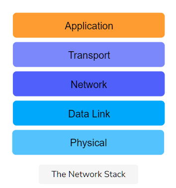
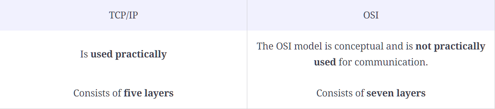
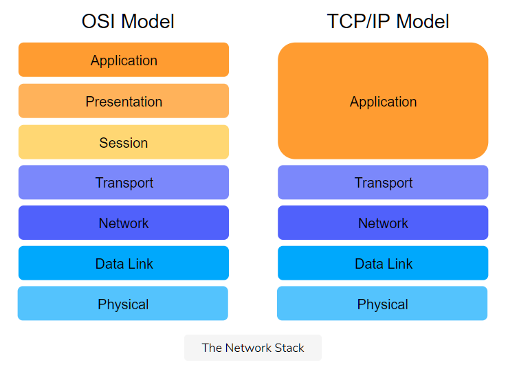

# Introduction

- The TCP/IP Model, also known as the **Internet protocol suite,** was **developed in 1989.**

- Its **development was funded by DARPA** (Advanced Research Projects Agency (ARPA) was renamed to the Defense Advanced Research Projects Agency (DARPA)!)

- Its technical specifications are detailed in RFC 1122.

- This model is primarily based upon the most protocols of the Internet, namely the **Internet Protocol (IP)** and the **Transmission Control Protocol (TCP).**

- The protocols in each layer are **clearly defined,** unlike in the OSI model. In this course, we’ll largely adhere to the TCP/IP model and take a protocol-oriented approach.

# The Layers of The TCP/IP Stack

The TCP/IP model splits up a communication system into **5 abstract layers,** stacked upon each other. Each layer performs a particular service and communicates with the layers above and below itself.

Here are the five layers of the TCP/IP model:

# TCP/IP vs OSI

## Key Differences

Here are some main differences between TCP/IP and OSI.

- Elaborating further on the first point, OSI is a **theoretical model** and works very well for teaching purposes, but it’s far too complex for anyone to implement.

- TCP/IP, on the other hand, wasn’t really a model. People just implemented it and got it to work. Then, people **reverse-engineered a reference model** out of it for theoretical and pedagogical purposes. So, something that “sounds like” a great idea might not be the eventual winner. It’s de facto vs de jure standards.

## Differences in Layer Functionality

The layers in the TCP/IP stack largely perform the same functions as their counterparts in the OSI model, except that the application layer in the TCP/IP model encompasses the functionalities of the top three layers of the OSI model.

Have a look at the following diagram for a more concrete view.

# There is No Unanimous Stack

This is an example of where primary sources like RFCs clash with secondary sources like textbooks. There is, in fact, an entire table on Wikipedia dedicated to the prominent layer stacks! Regardless, we’ll be sticking to the TCP/IP model described above.

# The End-To-End Argument in System Design

The TCP/IP protocol suite is heavily influenced by the following design choice, also known as the **end-to-end argument.**

Implementing intelligence in the core was too expensive, therefore, intelligence was implemented at edge devices. So, the Internet’s design was of **intelligent end devices** and a **dumb and fast core network.**

## Packet Switched Core

Furthermore, the core was made **packet-switched,** which means that packets are routed **per-hop,** so they can circumvent failures because the requirement was for resilience.

With **circuit-switched networks,** however, torn connections have to be re-established, if there is still a path.

