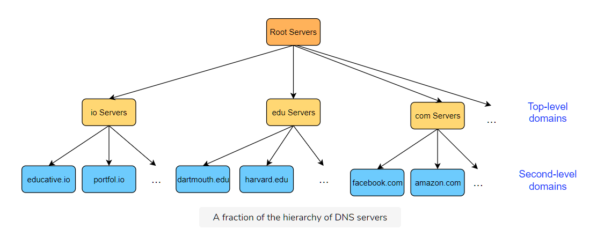

# How Do We Find Things on The Internet?

Generally, using one of the following ways:

- **Addresses** or **locations** that specify where something is.

  - Just like with a physical address, we still may need a map to get to the address. On the Internet, the addresses are typically IP addresses, and routers know the map.

- **Names.** In particular, domain names, or the unique name that identifies a websites, are mapped into IP addresses based on lookup service that uses a database. The most well-known lookup service is the **Domain Name System (DNS).** So when you enter the URL ‘[educative.io](http://educative.io/)’ into your browser, it uses DNS to find the actual IP address of the server that hosts it.

- **[Content-based addressing.](https://en.wikipedia.org/wiki/Content-addressable_storage)**

  - The content itself is used to look up its location.

> **Note A Useful Analogy:** Domain names are like actual people names and IPs are like phone numbers.

In this lesson, our focus will be on **DNS,** the client-server application layer protocol that translates hostnames on the Internet to IP addresses.

At the core, the Internet operates on IP addresses, but these are difficult to remember for humans. So, DNS names are preferably used at the application layer for which the DNS provides a mapping to IP addresses. For example, HTTP first translates the DNS hostname provided by the user in the URL to its IP address and then attempts to connect to the server. Furthermore, DNS is not just a protocol. It also consists of a distributed database of names that map to IP addresses. So essentially it’s a directory service.

# Distributed Hierarchical Database

One single database on one single server does not scale for reasons such as:

- Single point of failure. If the server that has the database crashes, DNS would stop working entirely, which is too risky.

- Massive amounts of traffic. Everyone would be querying that one server. It will not be able to handle that amount of load.

- Maintenance. Maintaining the server would become critical to the operation of DNS.

- Location. Where would the server be located?

This is why DNS employs several servers, each with part of the database. Also, the servers exist in a hierarchy. To understand this hierarchy better, you need to understand how URLs are broken down into their hierarchies. Have a look at the following diagram.

# DNS Namespaces

The parts of the URL above roughly map to DNS servers. These servers manage the abstract space of domains. The servers all exist in a hierarchy. Have a look at the following diagram.

## Root DNS Servers

Root DNS servers are the first point of contact for a DNS query (after the client’s local cache of names and IP addresses). They exist at the top of the hierarchy and point to the appropriate TLD server in reply to the query. So a query for <code>educative.io</code> would return the IP address of a server for the top-level domain, <code>io</code>.

As of the writing of this course, there are 1017 instances of root servers operated by 12 different organizations. To get a full list and an interactive map, have a look at [root-servers.org.](http://root-servers.org/)

## Top-level Servers

Servers in the top-level domain hold mappings to DNS servers for certain domains. Each domain is meant to be used by specific organizations only. Here are some common domains:

- **com:** This TLD was initially meant for **commercial** organizations only - but it has now been opened for general use.

  - Example: [codinginterview.com](http://codinginterview.com/)

- **edu:** Used by educational institutions.

  - Example: [stanford.edu](http://stanford.edu/)

- **gov: Only** used by the U.S. government.

  - Example: [nasa.gov](http://nasa.gov/)

- **mil:** Used by U.S. military organizations.

  - Example: army.mil

- **net:** It was initially intended for use by organizations working in network technology such as ISPs, but it is now a general purpose domain like com.

  - Example: [doubleclick.net](http://doubleclick.net/)

- **org:** This domain was intended for non-profit organizations but has been opened for general use now.

  - [mozilla.org](http://mozilla.org/)

- **pk, uk, us,…:** Country suffixes. 244 two-letter ones exist.

- Some new and uncommon suffixes include: **name, mobi, biz, pro.**

- **International domains:** 中國

Today, the set of top-level domain-names is managed by the [Internet Corporation for Assigned Names and Numbers (ICANN).](https://www.icann.org/)

Once one of these servers is contacted, it points to the authoritative name server of that organization.

## Authoritative Servers

Every organization with a public website or email server provides DNS records. These records have hostname to IP address mappings stored for that organization. These records can either be stored on a dedicated DNS server for that organization or they can pay for a service provider to store the records on their server.

This is the next link in the chain. If this server has the answer that we are looking for, the IP address that it has is finally returned to the client. However, this server may not have the sought after answer if the domain has a **sub-domain.** In that case, this server may point to a server that has records of the subdomain.

For instance, if the DNS record for [cs.stanford.edu](http://cs.stanford.edu/) is being looked for, a DNS server separate from ‘[stanford.edu](http://stanford.edu/)’ may hold records for the sub-domain ‘cs.’

# Local DNS Cache

- DNS mappings are often also cached locally on the client end-system to avoid repetitive lookups and saves time for often visited websites.

- This is done via an entity called the **local resolver library**, which is part of the OS. The application makes an API call to this library. This library manages the local DNS cache.

- If the local resolver library does not have a cached answer for the client, it will contact the organization’s local DNS server.

- This local DNS server is typically configured on the client machine either using a protocol called **DHCP** or can be configured statically.

- So, if it’s configured manually, any local DNS server of the client’s choice can be chosen. A few open DNS servers are incredibly popular, such as the ones by [Google](https://en.wikipedia.org/wiki/Google_Public_DNS).

# Local DNS Servers

There is one type of server that we ignored — the **local DNS Server.** Local DNS servers are usually the first point of contact after a client checks its local cache. These servers are generally hosted at the ISP and contain some mappings based on what websites users visit.

> **Security Warning:** ISPs have a record of which IP address they assigned to which customers. Furthermore, their DNS server has the IP addresses of who contacts it and what hostname they were trying to resolve. So your **ISP technically has a record of all of the websites you visit. Yikes!** P.S. if this makes you uncomfortable, you can change your DNS server to any open public DNS server.

