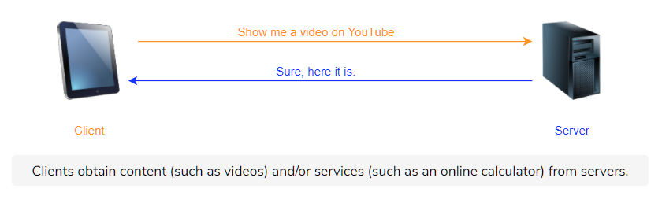
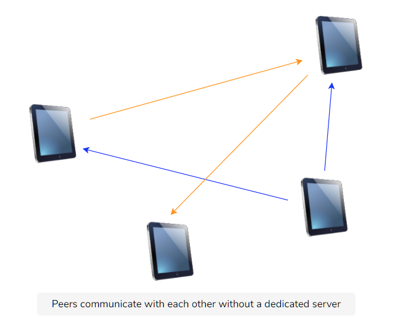

Before we start off with application layer protocols, **it’s important to understand how applications are structured across end systems.** This is called the network application’s **architecture** and it’s designed by application developers. The architecture lays out **how the application communicates and with what.**

Let’s discuss some common application architectures.

# Client-Server Architecture

In this architecture, a network application consists of two parts: **client-side** software and **server-side** software. These pieces of software are generally called **processes,** and they communicate with each other through **messages.**

## Servers

The server process controls access to a centralized resource or service such as a website.

Servers have two important characteristics:

1. Generally, an attempt is made to keep servers online all the time, although 100% availability is impossible to achieve. Furthermore, servers set up as a hobby or as an experiment may not need to be kept online. Nevertheless, the client must be able to find the server online when needed, otherwise, communication wouldn’t take place.

2. They have at least one reliable IP address with which they can be reached.

A good analogy is a 24/7 pizza delivery place. They are always open and have a phone number with which they can always be reached.

## Clients

Client processes use the Internet to consume content and use the services. Client processes almost always initiate connections to servers, while server processes wait for requests from clients.

## An Example

A good example of the client-server architecture is the **web.**

Take **Google** for instance. Google has several servers that control access to videos. So when a google.com is accessed, a client process (a browser) requests Google’s homepage from one of Google’s servers. That server was presumably online, got the request, and granted access to the page by sending it.

# Data Centers

Now, you might have noticed that we mentioned that Google has servers and not one server. That’s because, as mentioned previously, when client-server applications scale, one or even two servers can’t handle the requests from a large number of clients. Additionally, servers may crash due to any reason and might stop working. Most applications have several servers in case one fails. Therefore, several machines host server processes (these machines are called servers too), and they reside in **data centers.**

Data centers are buildings that house servers. Facebook, for example, has “nearly 15 million square feet of data center space completed or under construction, with several million more feet in the planning stages” as of **2018.**

## Peer-to-Peer Architecture (P2P)

In this architecture, applications on end-systems called ‘peers’ communicate with each other. No dedicated server or large data center is involved. Peers mostly reside on PCs like laptops and desktops in homes, offices, and universities.

The key advantage of the P2P architecture is that it can scale rapidly – without the need of spending large amounts of money, time or effort.

Regardless of P2P’s decentralized nature, each peer can be categorized as servers or clients i.e., every machine is capable of being a client as well as a server. Strictly speaking, the peer that initiates a connection is the client, and the other one is called the server.

## An Example

A lot of popular applications today, like **BitTorrent,** are based on P2P architectures.

When a file is downloaded via BitTorrent, the downloading party accesses **bits** of the file on several other users’ computers and puts them together on its end. No traditional ‘server’ is involved in this scenario.

> **Note: P2P Is Not the Same as File Sharing!** Some early P2P applications were used for file sharing. For example, Napster and Gnutella. Because of the massive impact of these P2P applications, a lot of people associate file sharing exclusively with P2P.

> **File sharing** is a specific application. Whereas **P2P** is a design principle for distributed systems and an application architecture.

> Also, file sharing is not the only application of P2P. Other examples include: streaming media, telephony, content distribution, routing, and volunteer computing.

# Hybrid

The hybrid architecture involves server involvement to some degree. It’s essentially a combination of the P2P and client-server architectures.
