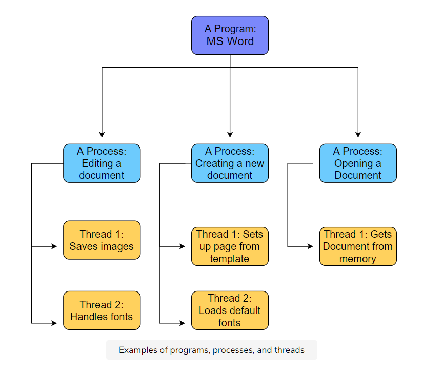

# Program vs. Process vs. Thread

We’ve loosely used the term ‘process’ pretty much interchangeably with the term ‘application’ in the last few chapters. Now, let’s now get a finer definition.

- A **program** is simply an executable file. An application such as MS Word is one example.

- A **process** is any currently running instance of a program. So one program can have several copies of it running at once. One MS Word program can have multiple open windows.

- A **thread** is a lightweight process. One process can have multiple running threads. The difference between threads and processes is that threads do lightweight singular jobs.

Here’s the MS Word example illustrated:

Processes that exist on the same machine can and do regularly communicate with each other following the rules of the machine’s OS. However, we are more interested in how processes that run on different machines communicate.

# Sockets

Processes on different machines send messages to each other through the computer network. The _interface_ between a process and the computer network is called a **socket.** Note that sockets do not have anything to do with hardware – they are software interfaces.

Processes simply direct their messages to sockets and don’t worry about it after that.

# Addressing

Messages have to be addressed to a certain application on a certain end system. How is it done with potentially millions of end systems and hundreds of applications on each of them?

Well, it’s done via addressing constructs like **IP addresses and ports.** While both were touched upon previously, we would like to reintroduce ports a bit more in-depth.

## Ports

Since every end-system may have a number of applications running, **ports** are used to address the packet to specific applications. As stated previously, some ports are reserved such as port 80 for HTTP and port 443 for HTTPS.

### An Analogy: Post

Continuing with our post analogy, you can think of an end-system like a large apartment complex. Each apartment in the complex is an application.

The mailing address of the complex is like the IP address of the end-system. All running applications share it, just like all apartments share the street address. Each application running on a host has a different port number, just like each apartment has a different apartment number.

### Ephemeral Ports

The port that an application will use is usually predefined by its application developers. So an application can have port 3000 reserved for it. But what if **several instances (processes) of an application are running at once?** How will the system address those processes?

Well, the answer lies in Ephemeral Ports. Different port numbers are dynamically generated for each instance of an application. The port is freed once the application is done using it.

Furthermore, **server processes need to have well defined and fixed port numbers** so that clients can connect to them in a systematic and predictable way. However, **clients don’t need to have reserved ports.** They can use ephemeral ports. Servers can also use ephemeral ports **in addition** to the reserved ones. For instance, a client makes the initial connection to the server on a well-known port and the rest of the communication is carried out by connecting to an ephemeral port on the server.

