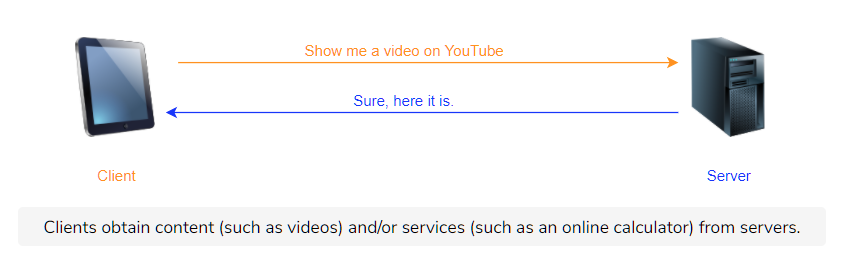

# Introduction

The Internet was an obscure set of methods for file transfer and email used by academics and researchers. The World Wide Web was invented to allow the European research organization CERN to present documents linked by hypertexts. All of that changed though when it caught the public’s eye and popularized the Internet. The web was different from other services such as cable television, because it served content based on demand. People could watch what they wanted. **HTTP** or **HyperText Transfer Protocol** is the protocol at the core of the web.

# Objects

- Web pages are objects that consist of other **objects.**

- An **object is simply a file** like an HTML file, PNG file, MP3 file, etc.

- Each object has a URL

- The **base object** of a web page **is often an HTML file** that has **references to other objects** by making requests for them via their URL.

> **Note: HTML** or HyperText Markup Language is the standard markup language to build webpages.

# The Anatomy of a URL

A **URL,** or **Universal Resource Locator,** is used to locate files that exist on servers. URLs consist of the following parts:

- **Protocol** in use

- The **hostname** of the server

- The **location of the file**

- **Arguments** to the file

# HTTP

Let’s get back into **HTTP.** It’s a client-server protocol that specifies how Web clients request Web pages from Web servers and how Web servers send them.

Remember the following diagram from the lesson on Network Application Architectures? Well, it was actually outlining HTTP in general.

- The **orange** arrow represents an **HTTP request**

- The **blue** arrow represents an **HTTP response**

The first message is called an **HTTP request** and the second one an **HTTP response.** There’s a whole class of protocols that are considered **request-response protocols.** HTTP is one of them. We will look in more detail at the HTTP request message in the next lesson and response after that!

Note that HTTP is a **stateless protocol:** servers do not store any information about clients by default. So if a client requests the same object multiple times in a row, the server would send it and would not know that the same client is requesting the same object repeatedly.

# HTTP Requires Lower Layer Reliability

- Application layer protocols rely on underlying transport layer protocols called **UDP** (User Datagram Protocol) and **TCP** (Transmission Control Protocol).

- For now, all you need to know is that **TCP ensures that messages are always delivered.** Messages get delivered in the order that they are sent.

- **UDP does not ensure that messages get delivered.** This means that some messages may get dropped and so never be received.

- **HTTP uses TCP** as its underlying transport protocol so that messages are guaranteed to get delivered in order. This allows the application to function without having to build any extra reliability as it would’ve had to with UDP.

This sort of reliance on other layers for certain jobs is one of the key advantages of a layered architecture!

- **TCP is connection-oriented,** meaning a connection has to be initiated with servers using a series of starting messages.

- Once the connection has been made, the client exchanges messages with the server until the connection is officially closed by sending a few ending messages.

# Types of HTTP Connections

There are two kinds of HTTP connections:

- **Non-persistent HTTP connections**

- **Persistent HTTP connections**

These two kinds of HTTP connections use TCP differently. Let’s discuss the key advantages and disadvantages of each.

# Non-persistent HTTP

**Non-persistent HTTP** connections use **one TCP connection per request.** Assume a client requests the base HTML file of a web page. Here is what happens:

1. The client initiates a TCP connection with a server

2. The client sends an HTTP request to the server

3. The server retrieves the requested object from its storage and sends it

4. The client receives the object which in this case is an HTML file. If that file has references to more objects, steps 1-4 are repeated for each of those

5. The server closes the TCP connection

For each HTTP request, more requests tend to follow, as well to fetch images, javascript files, CSS files, and other objects.

The underlying TCP connection requires three TCP messages are sent between the client and server. Similarly, when the connection is closed, three TCP messages are sent back and forth between the client and server.

# Persistent HTTP

An HTTP session typically involves multiple HTTP request-response pairs, for which separate TCP connections are established and then torn down between the same client and server. This is inefficient. Later on, **Persistent HTTP** was developed, which used a single client-server TCP connection for all the HTTP request-responses for a session.

Typically, if there have been no requests for a while, the server closes the connection. The duration of time before the server closes the connection is configurable.
