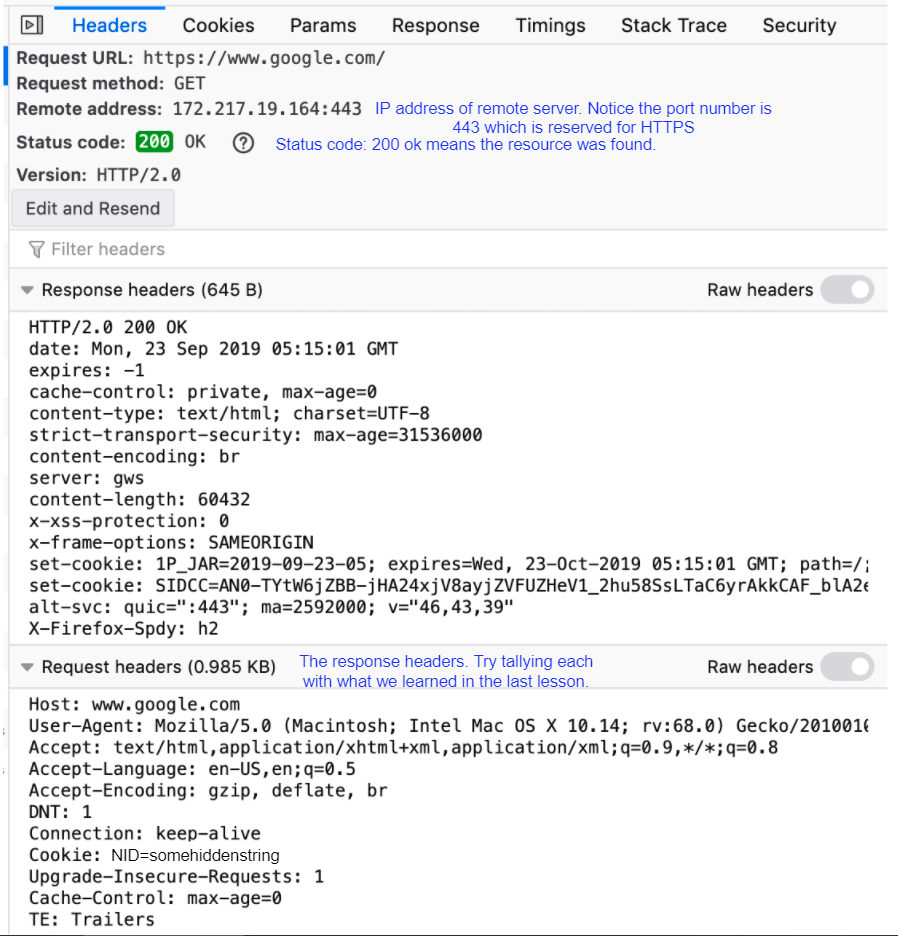

# Open up the Developer Tools on Your Browser

Have a look at this GIF. We were on **Firefox** here.

1. Navigate to any website. We picked google.com.

2. Right-click anywhere.

3. Click on ‘inspector tools’ in the drop-down menu.

The process should be similar for other browsers.

# Go to the Network Tab

1. The network tab should be one of the tabs on the top-bar (or sidebar in some browsers).

2. Find it and click on it.

3. There may be a chance that your browser hasn’t logged any network calls. In that case, just reload the page.

# Click on Any Entry

1. You’ll see a bunch of calls. Click on any one of them.

2. You’ll see details about the HTTP message including the request headers, the kind of request, and the headers. We encourage you to spend some time exploring this.

# An Example of an Entry

