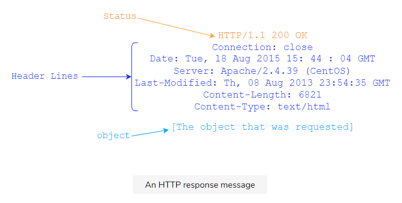

# Introduction

Let’s start with a typical example of an HTTP response message:

```
HTTP/1.1 200 OK
Connection: close
Date: Tue, 18 Aug 2015 15: 44 : 04 GMT
Server: Apache/2.2.3 (CentOS)
Last-Modified: Tue, 18 Aug 2015 15:11:03 GMT
Content-Length: 6821
Content-Type: text/html

[The object that was requested]
```

It has 3 parts: an initial **status line,** some **header lines** and an **entity body.**


> **Note: HTTP response messages don’t have the URL or the method fields.** Those are strictly for request messages.

# Status Line

- HTTP response status lines start with the **HTTP version.**

## Status Code

- The **status code** comes next which tells the client if the request succeeded or failed.

- There are a lot of status codes:

  - 1xx codes fall in the informational category

  - 2xx codes fall in the success category

  - 3xx codes are for redirection

  - 4xx is client error

  - 5xx is server error

Here is a list of some common status codes and their meanings:

- 200 OK: the request was successful, and the result is appended with the response message.

- 404 File Not Found: the requested object doesn’t exist on the server.

- 400 Bad Request: generic error code that indicates that the request was in a format that the server could not comprehend.

- 500 HTTP Internal Server Error: the request could not be completed because the server encountered some unexpected error.

- 505 HTTP Version Not Supported: the requested HTTP version is not supported by the server.

Have a look at pages 39 and 40 of [RFC 2616](https://www.ietf.org/rfc/rfc2616.txt) for a comprehensive list:

The first digit of the Status-Code defines the class of response. The last two digits do not have any categorization role. There are 5 values for the first digit:

- 1xx: Informational - Request received, continuing process

- 2xx: Success - The action was successfully received, understood, and accepted

- 3xx: Redirection - Further action must be taken in order to complete the request

- 4xx: Client Error - The request contains bad syntax or cannot be fulfilled

- 5xx: Server Error - The server failed to fulfill an apparently valid request

The individual values of the numeric status codes defined for HTTP/1.1, and an example set of corresponding Reason-Phrase's, are presented below. The reason phrases listed here are only recommendations -- they MAY be replaced by local equivalents without affecting the protocol.

Status-Code =
| "100" ; Section 10.1.1: Continue
| "101" ; Section 10.1.2: Switching Protocols
| "200" ; Section 10.2.1: OK
| "201" ; Section 10.2.2: Created
| "202" ; Section 10.2.3: Accepted
| "203" ; Section 10.2.4: Non-Authoritative Information
| "204" ; Section 10.2.5: No Content
| "205" ; Section 10.2.6: Reset Content
| "206" ; Section 10.2.7: Partial Content
| "300" ; Section 10.3.1: Multiple Choices
| "301" ; Section 10.3.2: Moved Permanently
| "302" ; Section 10.3.3: Found
| "303" ; Section 10.3.4: See Other
| "304" ; Section 10.3.5: Not Modified
| "305" ; Section 10.3.6: Use Proxy
| "307" ; Section 10.3.8: Temporary Redirect
| "400" ; Section 10.4.1: Bad Request
| "401" ; Section 10.4.2: Unauthorized
| "402" ; Section 10.4.3: Payment Required
| "403" ; Section 10.4.4: Forbidden
| "404" ; Section 10.4.5: Not Found
| "405" ; Section 10.4.6: Method Not Allowed
| "406" ; Section 10.4.7: Not Acceptable
| "407" ; Section 10.4.8: Proxy Authentication Required
| "408" ; Section 10.4.9: Request Time-out
| "409" ; Section 10.4.10: Conflict
| "410" ; Section 10.4.11: Gone
| "411" ; Section 10.4.12: Length Required
| "412" ; Section 10.4.13: Precondition Failed
| "413" ; Section 10.4.14: Request Entity Too Large
| "414" ; Section 10.4.15: Request-URI Too Large
| "415" ; Section 10.4.16: Unsupported Media Type
| "416" ; Section 10.4.17: Requested range not satisfiable
| "417" ; Section 10.4.18: Expectation Failed
| "500" ; Section 10.5.1: Internal Server Error
| "501" ; Section 10.5.2: Not Implemented
| "502" ; Section 10.5.3: Bad Gateway
| "503" ; Section 10.5.4: Service Unavailable
| "504" ; Section 10.5.5: Gateway Time-out
| "505" ; Section 10.5.6: HTTP Version not supported extension-code

# Header Lines

Let’s study the header lines.

- **Connection type.** In this case, indicates that the server will close the TCP connection after it sends the response.

- **Date.** The date at which the response was generated.

- **Server.** Gives server software specification of the server that generated the message. Apache in this case.

- **Last-Modified.** The date on which the object being sent was last modified.

- **Content-Length.** The length of the object being sent in 8-bit bytes.

- **Content-Type.** The type of content. The type of the file is not determined by the file extension of the object, but by this header.

The **response** body contains the file requested.

## How HTTP Headers Are Chosen

Lastly, you must be wondering how browsers decide which HTTP headers to include in requests and how servers decide which headers to return in the response. That **depends on a complex mix of factors such as the browser, the user configurations and products.**
