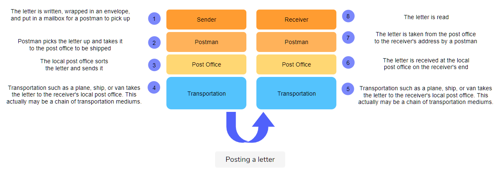
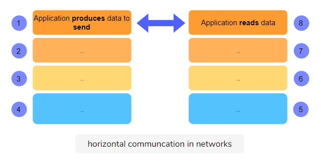
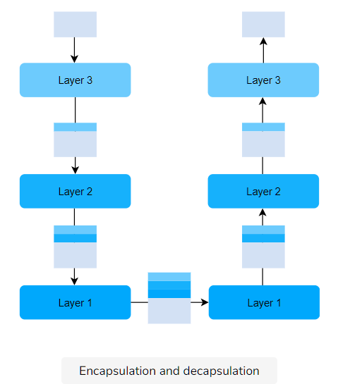

# Introduction to Layered Architectures

When building a large complex system, it helps to approach the problem at gradually increasing levels of abstraction. Thus, systems can be composed of **layers**, each performing a specific set of tasks.

## Why Layers?

Layered architectures give us modularity by allowing us to discuss **specific, well-defined parts of larger systems.** This makes **changing implementation-level details** and **identifying bugs easier.**

# An Analogy: Post

Before we dive deep into different models of the network layer stack, let’s look at an interesting analogy.

Think about posting a letter or a package. The general steps to doing so are as follows,

Notice that a few things are in **parallel with computer networking** here. Here are some examples of how that is the case:

# Layers As Services To Each Other: Layers Are Vertical

**Each layer provides some services to the layer above it.** Furthermore, the layer above is **not concerned with the details of how the layer below performs its services.** This is called **abstraction.** So in this way, the layers communicate with each other in a vertical fashion.

## Vertical Layers in Post

In our letter analogy, each layer is servicing the layer above it. For instance, the postman provides services to the senders and receivers. They collect dropped letters from mailboxes and deliver mail to the houses.

Furthermore, all a sender knows and cares about is that once they write a letter, put it in an envelope, stick a stamp on it and drop it in a letterbox, it will eventually be delivered at the destination. Whether it’s transported on pickup trucks, on railway trains or by air is irrelevant and immaterial to senders. So, how layer 4 does its job is irrelevant to the layers above, and that’s called **abstraction.**

## Vertical Layers in Networks

Similarly, computer networks are conceptually divided into layers that each serves the layer above and below it.

- For example, the top layer in most layered models is called the **application layer**. End-user applications live in the application layer, which includes the web and email and are almost always implemented in software. The application layer is also where an outgoing message starts its journey.

- The application needs an underlying service that can get application messages delivered from source to destination and bring back replies which is what the layer(s) after do(es).

Since the underlying layer collects messages from the upper layer for delivery to the destination and hands over messages destined for the upper layer, it **serves the application layer.** Furthermore, the application layer **abstracts,** and hence is not concerned with any implementation details of the layers below.

# Layers Communicate with Their Parallels: Layers Are Horizontal

Note that each layer at the sending end has a parallel in the receiving end.

## Horizontal Layers in Post

In the post analogy, the letter writer and receiver appear to be in direct communication with each other. The writer writes, the reader reads, oblivious to the man-hours spent in the lower layers. Similarly, the post office at the sender’s side is in communication with some other post office. They cooperate in getting the letter delivered. At the lowest layer, there could be multiple hops. For instance, there is a bicycle pickup of letters from a box, delivered to the post office. Then, the letters are bundled and sent by pickup truck to an airport. The airport flies the postage to a different airport. The airport sends the postage to a post office by a pickup truck and the delivery ensues. Sometimes there are multiple entities horizontally, but we only see the sender and the receiver.

## Horizontal Layers in Networks

This makes more sense in the case of computer networks. For example, applications in the **application layer** send and receive data from the network. The application layer on one end system has a parallel on another end system, i.e., a chat app on one end system could be communicating with a chat app on another. **These applications in the application layer are seemingly communicating with each other directly or horizontally.** They are not aware of the layer below.

# Layers Evolve Independently

Any lower layer in this model provides certain services that the upper layer can build other services upon. The upper layer can evolve to build different kinds of services, like going from text-based email to attachments, to the world wide web, to dynamic websites, interactive gaming, interactive video conferencing and so on, all happening in the top layer over the same infrastructure.

## Independent Evolution in Post

1. For instance, the item being sent does not necessarily have to be a **letter** – It can also be a **package**.
2. It can be put in an **envelope or a box**.
3. It can be taken to the **post office, dropped off into a post box, or picked up**.
4. The receiver’s end can be a **P.O. box, a home or an office.**

## Independent Evolution in Networks

The applications in the application layer can send and receive almost any form of data, be it an **mp3 file or a word document.**

# Encapsulation & Decapsulation

Each layer adds its own header to the message coming from above and the receiving entity on the other end removes it. The information in each header is useful for transmitting the message to the layer above. Adding the header is called encapsulation and removing it is called decapsulation. Have a look at the following slides to see how this works.

Take a look at the following drawing. We have not given names to these layers because we have not introduced them yet, but the general idea is depicted.

