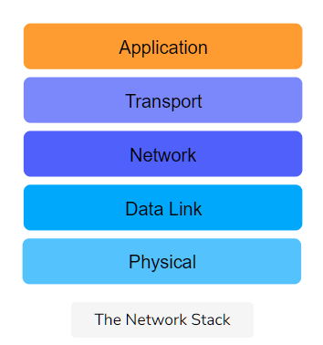

# Introduction

- The TCP/IP Model, also known as the **Internet protocol suite,** was **developed in 1989.**

- Its **development was funded by DARPA** (Advanced Research Projects Agency (ARPA) was renamed to the Defense Advanced Research Projects Agency (DARPA)!)

- Its technical specifications are detailed in RFC 1122.

- This model is primarily based upon the most protocols of the Internet, namely the **Internet Protocol (IP)** and the **Transmission Control Protocol (TCP).**

- The protocols in each layer are **clearly defined,** unlike in the OSI model. In this course, we’ll largely adhere to the TCP/IP model and take a protocol-oriented approach.

# The Layers of The TCP/IP Stack

The TCP/IP model splits up a communication system into **5 abstract layers,** stacked upon each other. Each layer performs a particular service and communicates with the layers above and below itself.

Here are the five layers of the TCP/IP model:

